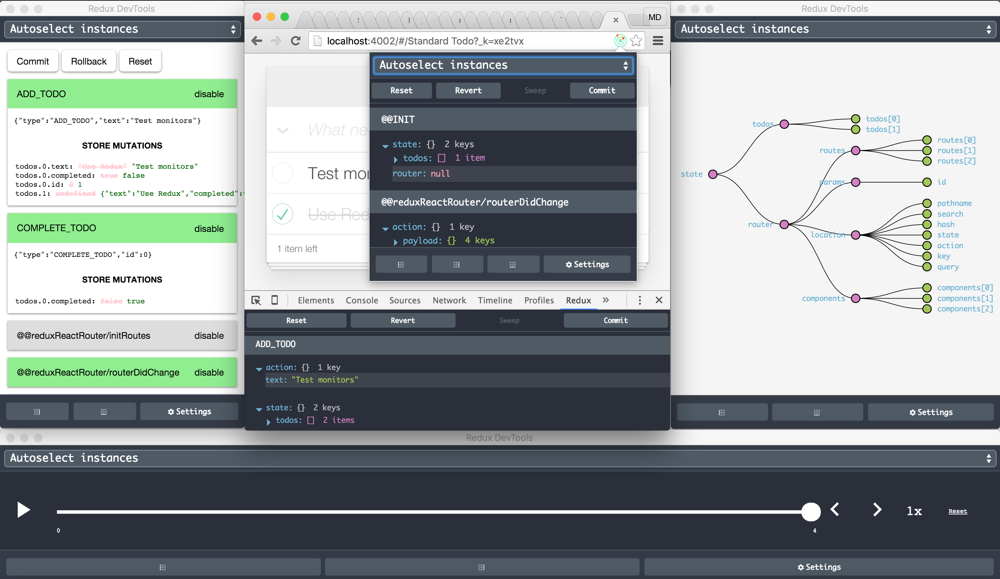

# Redux DevTools Extension



## Advantages

1. Simple implementation (only [1 line of code](https://github.com/zalmoxisus/redux-devtools-extension/commit/6c146a2e16da79fefdc0e3e33f188d4ee6667341) without importing anything!).
2. Having DevTools even in production without any drawbacks. 
2. Keeping the DevTools up to date (Chrome extension is updated automatically).
3. Having Redux DevTools in a page without window (Chrome extensions’ background page).
4. Using DevTools remotely for Chrome Mobile.

## Implementation

#### 1. Get the extension
 - from [Chrome Web Store](https://chrome.google.com/webstore/detail/redux-devtools/lmhkpmbekcpmknklioeibfkpmmfibljd)
 - or build it with `npm i & npm run build:extension` and [load the extension's folder](https://developer.chrome.com/extensions/getstarted#unpacked) `./build/extension`
 - or run it in dev mode with `npm i & npm start` and [load the extension's folder](https://developer.chrome.com/extensions/getstarted#unpacked) `./dev`.

#### 2. Use with [Redux](https://github.com/rackt/redux)
  Just update your [configureStore](https://github.com/zalmoxisus/redux-devtools-extension/commit/9c631ef66f53e51f34b55f4642bd9ff2cbc7a992):
  ```javascript
  export default function configureStore(initialState) {
    const store = createStore(reducer, initialState, compose(
      applyMiddleware(...middleware)
    ));
    return store;
  }
  ```
  *becomes*
  ```javascript
  export default function configureStore(initialState) {
    const store = createStore(reducer, initialState, compose(
      applyMiddleware(...middleware),
      window.devToolsExtension ? window.devToolsExtension() : f => f
    ));
    return store;
  }
  ```
  or [if you don't have other store enhancers and middlewares](https://github.com/zalmoxisus/redux-devtools-extension/commit/f26975cccff37f477001158019be7c9c9cb721b1):
  ```javascript
  export default function configureStore(initialState) {
    const store = createStore(reducer, initialState, 
      window.devToolsExtension ? window.devToolsExtension() : undefined
    );
    return store;
  }
  ```
  *or for universal (isomorphic) apps*
  ```javascript
    typeof window === 'object' && typeof window.devToolsExtension !== 'undefined' ? window.devToolsExtension() : f => f
  ```
  You can use it together with vanilla Redux DevTools as a fallback, but not both simultaneously:
  ```js
  window.devToolsExtension ? window.devToolsExtension() : DevTools.instrument()
  ```
  [Make sure not to render DevTools when using the extension](https://github.com/zalmoxisus/redux-devtools-extension/issues/57) or you'll probably want to render the monitor from vanilla DevTools as follows: 
  ```js
  { !window.devToolsExtension ? <DevTools /> : null }
  ```

##### For React Native, hybrid, desktop and server side Redux apps
  Include [`Remote Redux DevTools`](https://github.com/zalmoxisus/remote-redux-devtools), and on the extension's context choose 'Open Remote DevTools' or press Alt+Shift+arrow up for remote monitoring.

##### For [Freezer](https://github.com/arqex/freezer)
  Just use [supportChromeExtension](https://github.com/arqex/freezer-redux-devtools#using-redux-devtools-chrome-extension) from `freezer-redux-devtools/freezer-redux-middleware`.

## API
`window.devToolsExtension([config])`
- **config** arguments (optional)
  - **name** (*string*) - the instance name to be showed on the monitor page. Default value is `document.title`.
  - **deserializeState(state): transformedState** (*function*) - optional transformation of state deserialized from debug session (useful if state is not plain object. Example: immutable-js state)
    - state, transformedState - Redux state objects
  - **deserializeAction(action): transformedAction** (*function*) - optional transformation of actions deserialized from debug session (useful if actions are not plain object. Example: immutable-js action payload)
    - action, transformedAction - Redux action objects
  - **actionsBlacklist** (*array*) - actions to be hidden in DevTools. Overwrites corresponding global setting in the options page.
  - **actionsWhitelist** (*array*) - all other actions will be hidden in DevTools. Overwrites corresponding global setting in the options page.

## Examples
Open these urls to test the extension:

 - [Counter](http://zalmoxisus.github.io/redux-devtools-extension/examples/counter/)
 - [TodoMVC](http://zalmoxisus.github.io/redux-devtools-extension/examples/todomvc/)
 - [Redux Form](http://erikras.github.io/redux-form/#/examples/simple)
 - [Redux Router](http://zalmoxisus.github.io/redux-devtools-extension/examples/router/)
 - [Implemented in a Chrome app and extension](https://github.com/zalmoxisus/browser-redux)

Also you may run them from `./examples` folder (on port 4001 and 4002 by default).

## Videos

- [Live React: Hot Reloading with Time Travel at React Europe 2015](https://youtu.be/xsSnOQynTHs)
- [Getting Started with Redux Dev Tools (Chrome Extension)](https://egghead.io/lessons/javascript-getting-started-with-redux-dev-tools)

## FAQ

#### How to get it work
- Test the extension with [Counter](http://zalmoxisus.github.io/redux-devtools-extension/examples/counter/) or [TodoMVC](http://zalmoxisus.github.io/redux-devtools-extension/examples/todomvc/) demo.
- Reload the extension on the extensions page (`chrome://extensions/`).
- If something goes wrong, [open an issue](https://github.com/zalmoxisus/redux-devtools-extension/issues) or tweet me: [@mdiordiev](https://twitter.com/mdiordiev).

#### How to filter actions
On the options page you may enable actions filtering and specify either actions to be hidden or shown in DevTools. If the latter is specified, other than those actions will be hidden.
You can overwrite theese settings for an individual project using `actionsBlacklist` and `actionsWhitelist` [config options](#API).
#### How to disable/enable it in production
On the options page you may enable the extension to be injected in all pages or you may specify the pages urls to be injected in. Use regex values and new line as a separator. A good practice would be to add a condition for including the extension - a variable in localStorage or a url query, which will use only the developers.
#### How to persist debug sessions across page reloads
Just add `?debug_session=<session_name>` to the url.
#### How to include it in chrome apps and extensions
Unlike web apps, Chrome extension doesn't inject anything in other chrome extensions or apps, so you have to do it by yourself to allow debugging. Just add:
```
<script src="chrome-extension://lmhkpmbekcpmknklioeibfkpmmfibljd/js/inject.bundle.js"></script>
```
To include it in a chrome extension's content script follow [the example](https://github.com/zalmoxisus/browser-redux/commit/df2db9ee11f2d197c4329b2c8a6e197da1edffd4). 
#### How to open DevTools programmatically
```js
window.devToolsExtension.open();
```
#### How to keep DevTools window focused all the time in a chrome panel
To enable chrome panels feature in Chrome, type in `chrome://flags/#enable-panels` in the url bar and click on "enable" under "enable panels". Make sure to click on "relaunch now " at the bottom of the page, to take effect.
#### How to include DevTools in the page
You can open DevTools in a new window (by opening context menu with right mouse click), from popup (clicking on the browser action button) or from Chrome dev panel. If you still, for some reason, want to include it directly in your page, load the following url in iframe: `chrome-extension://lmhkpmbekcpmknklioeibfkpmmfibljd/window.html`. You'd probably include it in a docker or in a resizeable component.
#### How to enable/disable errors notifying
Just find `Redux DevTools` on the extensions page (`chrome://extensions/`) and click the `Options` link to customize everything. The errors notifying is enabled by default, but it works only when the store enhancer is called (in order not to show notifications for any sites you visit). In case you want notifications for a non-redux app, init it explicitly by calling `window.devToolsExtension.notifyErrors()` (probably you'll check if `window.devToolsExtension` exists before calling it).
#### How to get it work with WebWorkers, React Native, hybrid, desktop and server side apps
Of course, it is not possible to inject extension's script there and to communicate directly. To solve this we use [Remote Redux DevTools](https://github.com/zalmoxisus/remote-redux-devtools). Just find `Remote` button or press `Alt`+`Shift`+`arrow up` for remote monitoring. 
#### Keyboard shortcuts
Use `Cmd`+`Ctrl`+Arrows for OSX and `Alt`+`Shift`+Arrows for Windows, Linux and ChromeOS. Arrow down, left and right indicate the position of the DevTools window. Use `arrow up` to open Remote monitoring to communicate with [Remote Redux DevTools](https://github.com/zalmoxisus/remote-redux-devtools). To change the shortcuts, click "Keyboard shortcuts" button on the bottom of the extensions page (`chrome://extensions/`).

## Credits

 - Built with our [browser-redux](https://github.com/zalmoxisus/browser-redux) boilerplate.
 - Includes [Dan Abramov](https://github.com/gaearon)'s [redux-devtools](https://github.com/gaearon/redux-devtools).
 - Inspired from [Taylor Hakes](https://github.com/taylorhakes)' [work](https://github.com/taylorhakes/redux-devtools/tree/chrome-devtools).
 - [The logo icon](https://github.com/rackt/redux/issues/151#issuecomment-150060367) made by [Keith Yong](https://github.com/keithyong) .
 - Examples from [Redux](https://github.com/rackt/redux/tree/master/examples).

## LICENSE

[MIT](LICENSE)

## Created By

If you like this, follow [@mdiordiev](https://twitter.com/mdiordiev) on twitter.
