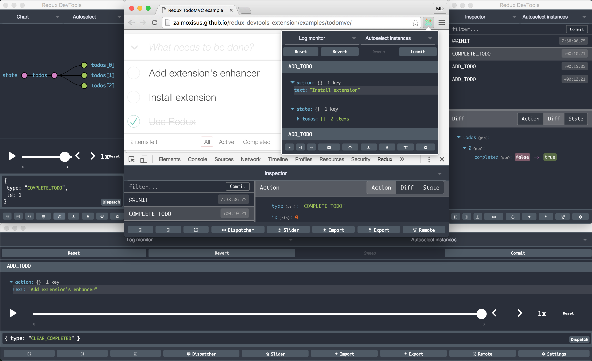

# Redux DevTools Extension

[](https://travis-ci.org/zalmoxisus/redux-devtools-extension) [](https://ci.appveyor.com/project/zalmoxisus/redux-devtools-extension)



## Implementation

#### 1. Get the extension
 - from [Chrome Web Store](https://chrome.google.com/webstore/detail/redux-devtools/lmhkpmbekcpmknklioeibfkpmmfibljd)
 - or build it with `npm i & npm run build:extension` and [load the extension's folder](https://developer.chrome.com/extensions/getstarted#unpacked) `./build/extension`
 - or run it in dev mode with `npm i & npm start` and [load the extension's folder](https://developer.chrome.com/extensions/getstarted#unpacked) `./dev`.

#### 2. Use with [Redux](https://github.com/rackt/redux)
  Just update your [configureStore](https://github.com/zalmoxisus/redux-devtools-extension/commit/9c631ef66f53e51f34b55f4642bd9ff2cbc7a992):
  ```javascript
  import { createStore, applyMiddleware, compose } from 'redux';
  
  export default function configureStore(initialState) {
    const store = createStore(reducer, initialState, compose(
      applyMiddleware(...middleware)
    ));
    return store;
  }
  ```
  *becomes*
  ```javascript
  export default function configureStore(initialState) {
    const store = createStore(reducer, initialState, compose(
      applyMiddleware(...middleware),
      window.devToolsExtension ? window.devToolsExtension() : f => f
    ));
    return store;
  }
  ```
  or [if you don't have other store enhancers and middlewares](https://github.com/zalmoxisus/redux-devtools-extension/commit/f26975cccff37f477001158019be7c9c9cb721b1):
  ```javascript
  export default function configureStore(initialState) {
    const store = createStore(reducer, initialState, 
      window.devToolsExtension && window.devToolsExtension()
    );
    return store;
  }
  ```
  *or for universal (isomorphic) apps*
  ```javascript
    typeof window === 'object' && typeof window.devToolsExtension !== 'undefined' ? window.devToolsExtension() : f => f
  ```
  You can use it together with vanilla Redux DevTools as a fallback, but not both simultaneously:
  ```js
  window.devToolsExtension ? window.devToolsExtension() : DevTools.instrument()
  ```
  [Make sure not to render DevTools when using the extension](https://github.com/zalmoxisus/redux-devtools-extension/issues/57) or you'll probably want to render the monitor from vanilla DevTools as follows: 
  ```js
  { !window.devToolsExtension ? <DevTools /> : null }
  ```
  
  Note: passing enhancer as last argument requires redux@>=3.1.0. For older versions apply it like [here](https://github.com/zalmoxisus/redux-devtools-extension/blob/v0.4.2/examples/todomvc/store/configureStore.js) or [here](https://github.com/zalmoxisus/redux-devtools-extension/blob/v0.4.2/examples/counter/store/configureStore.js#L7-L12).

#### For React Native, hybrid, desktop and server side Redux apps
  Include [`Remote Redux DevTools`](https://github.com/zalmoxisus/remote-redux-devtools), and from the extension's context menu choose 'Open Remote DevTools' or press Alt+Shift+arrow up for remote monitoring.

## Documentation

- [FAQ](docs/FAQ.md)
- API Reference
  - [Apply as a Redux store enhancer](docs/API/Arguments.md#windowdevtoolsextensionconfig)
  - [Create Redux store right in the extension](docs/API/Arguments.md#windowdevtoolsextensionreducer-preloadedstate-config)
  - [Communicate with the extension directly](docs/API/Methods.md)
    - [open](docs/API/Methods.md#windowdevtoolsextensionopenposition)
    - [notifyErrors](docs/API/Methods.md#windowdevtoolsextensionnotifyerrorsonerror)
    - [send](docs/API/Methods.md#windowdevtoolsextensionlistenonmessage-instanceid)
    - [connect](docs/API/Methods.md#windowdevtoolsextensionconnectconfig)
    - [disconnect](docs/API/Methods.md#windowdevtoolsextensiondisconnect)
- [Troubleshooting](docs/Troubleshooting.md)
- [Change Log](https://github.com/zalmoxisus/redux-devtools-extension/releases)
- [Feedback](docs/Feedback.md)

##📺 Videos

- [Debugging flux applications in production at React Europe 2016](https://youtu.be/cbXLohVbzNI)
- [Hot Reloading with Time Travel at React Europe 2015](https://youtu.be/xsSnOQynTHs)
- [Getting Started with Redux DevTools Extension](https://egghead.io/lessons/javascript-getting-started-with-redux-dev-tools)

## Demo
Open these urls to test the extension:

 - [Counter](http://zalmoxisus.github.io/redux-devtools-extension/examples/counter/)
 - [TodoMVC](http://zalmoxisus.github.io/redux-devtools-extension/examples/todomvc/)
 - [Redux Form](http://erikras.github.io/redux-form/#/examples/simple)
 - [Redux Router](http://zalmoxisus.github.io/redux-devtools-extension/examples/router/)
 - [Implemented in a Chrome app and extension](https://github.com/zalmoxisus/browser-redux)

Also you may run them from `./examples` folder (on port 4001 and 4002 by default).

## Credits

 - Built using [Crossbuilder](https://github.com/zalmoxisus/crossbuilder) boilerplate.
 - Includes [Dan Abramov](https://github.com/gaearon)'s [redux-devtools](https://github.com/gaearon/redux-devtools).
 - Inspired from [Taylor Hakes](https://github.com/taylorhakes)' [work](https://github.com/taylorhakes/redux-devtools/tree/chrome-devtools).
 - [The logo icon](https://github.com/rackt/redux/issues/151#issuecomment-150060367) made by [Keith Yong](https://github.com/keithyong) .
 - Examples from [Redux](https://github.com/rackt/redux/tree/master/examples).

## LICENSE

[MIT](LICENSE)

## Created By

If you like this, follow [@mdiordiev](https://twitter.com/mdiordiev) on twitter.
