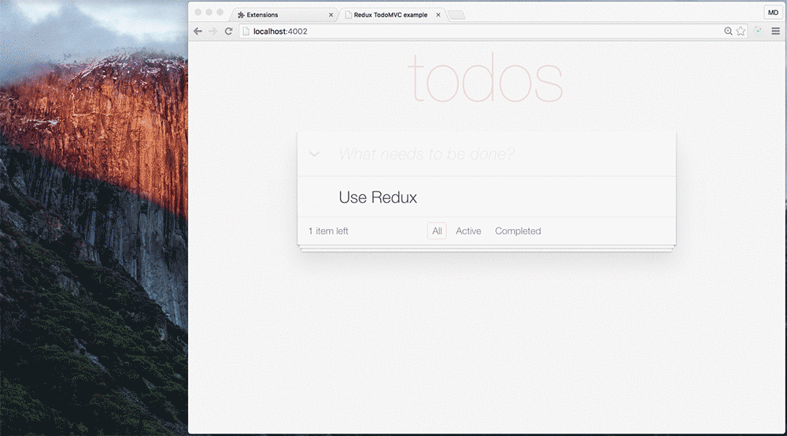

# Redux DevTools Extension



If you do not know what [Redux DevTools](https://github.com/gaearon/redux-devtools) is, [see Dan's React Europe talk](https://www.youtube.com/watch?v=xsSnOQynTHs)!

## Advantages

1. Simple implementation (only [1 line of code](https://github.com/zalmoxisus/redux-devtools-extension/commit/ffa804594008c585d28b3319bfcd4b87d5df384d) without importing anything!).
2. Having DevTools even in production without any drawbacks. 
2. Keeping the DevTools up to date (Chrome extension is updated automatically).
3. Having Redux DevTools in a page without window (Chrome extensions’ background page).
4. Using DevTools remotely for Chrome Mobile.

## Implementation

1. [Load the extension's folder](https://developer.chrome.com/extensions/getstarted#unpacked) `./build/extension`.
2. Update your [configureStore](https://github.com/zalmoxisus/redux-devtools-extension/commit/ffa804594008c585d28b3319bfcd4b87d5df384d):
    ```javascript
    const store = createStore(rootReducer, initialState);
    ```
    becomes
    ```javascript
    const store = (window.devToolsExtension ? window.devToolsExtension(createStore) : createStore)(rootReducer, initialState);
    ```

    or
    ```javascript
        const finalCreateStore = compose(
          applyMiddleware(thunk),
          ...
        )(createStore);
    ```
    becomes
    ```javascript
    const finalCreateStore = compose(
      applyMiddleware(thunk),
      ...
      window.devToolsExtension || (f => f)
    )(createStore);
    ```
    
## Credits

 - Built with our [browser-redux](https://github.com/zalmoxisus/browser-redux) boilerplate.
 - Includes [Dan Abramov](https://github.com/gaearon)'s [redux-devtools](https://github.com/gaearon/redux-devtools).
 - Inspired from [Taylor Hakes](https://github.com/taylorhakes)' [work](https://github.com/taylorhakes/redux-devtools/tree/chrome-devtools).
 - Uses [Keith Yong](https://github.com/keithyong)'s [icon](https://github.com/rackt/redux/issues/151#issuecomment-150060367).
 - Examples from [Redux](https://github.com/rackt/redux/tree/master/examples).

## Roadmap

- [ ] Show popup icon, context menu and dev panel only when there’s a redux script in the tab.
- [ ] Persist state.
- [ ] Publish the extension to the Chrome Web Store.
- [ ] Firefox extension.

## LICENSE

[MIT](LICENSE)