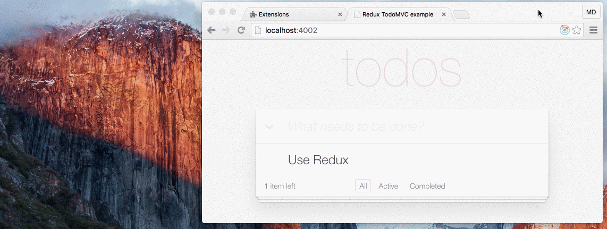

# Redux DevTools Extension



If you do not know what [Redux DevTools](https://github.com/gaearon/redux-devtools) is, [see Dan's React Europe talk](https://www.youtube.com/watch?v=xsSnOQynTHs)!

## Advantages

1. Simple implementation (only [1 line of code](https://github.com/zalmoxisus/redux-devtools-extension/commit/6c146a2e16da79fefdc0e3e33f188d4ee6667341) without importing anything!).
2. Having DevTools even in production without any drawbacks. 
2. Keeping the DevTools up to date (Chrome extension is updated automatically).
3. Having Redux DevTools in a page without window (Chrome extensions’ background page).
4. Using DevTools remotely for Chrome Mobile.

## Implementation

#### 1. Get the extension
 - from [Chrome Web Store](https://chrome.google.com/webstore/detail/redux-devtools/lmhkpmbekcpmknklioeibfkpmmfibljd)
 - or build it with `npm i & npm run build:extension` and [load the extension's folder](https://developer.chrome.com/extensions/getstarted#unpacked) `./build/extension`
 - or run it in dev mode with `npm i & npm start` and [load the extension's folder](https://developer.chrome.com/extensions/getstarted#unpacked) `./dev`.

#### 2. Use with your favorite Flux implementation

- **[Redux](https://github.com/rackt/redux)**<br/>
    Just update your [configureStore](https://github.com/zalmoxisus/redux-devtools-extension/commit/6c146a2e16da79fefdc0e3e33f188d4ee6667341):
    ```javascript
    const finalCreateStore = compose(
      applyMiddleware(thunk),
      ...
    )(createStore);
    ```
    *becomes*
    ```javascript
    const finalCreateStore = compose(
      applyMiddleware(thunk),
      ...
      window.devToolsExtension ? window.devToolsExtension() : f => f
    )(createStore);
    ```

- **[Freezer](https://github.com/arqex/freezer)**<br/>
    Just use [supportChromeExtension](https://github.com/zalmoxisus/freezer-redux-devtools#using-redux-devtools-chrome-extension) from `freezer-redux-devtools/freezer-redux-middleware`.

## Examples
Open these urls to test the extension:

 - [Counter](http://zalmoxisus.github.io/redux-devtools-extension/examples/counter/)
 - [TodoMVC](http://zalmoxisus.github.io/redux-devtools-extension/examples/todomvc/)
 - [Redux Form](http://erikras.github.io/redux-form/#/examples/simple)
 - [Implemented with FreezerJS](http://freezer-redux-devtools.divshot.io/)
 - [Implemented in a Chrome app and extension](https://github.com/zalmoxisus/browser-redux)

Also you may run them from `./examples` folder (on port 4001 and 4002 by default).

## FAQ

#### How to get it work
- Test the extension with [Counter](http://zalmoxisus.github.io/redux-devtools-extension/examples/counter/) or [TodoMVC](http://zalmoxisus.github.io/redux-devtools-extension/examples/todomvc/) demo.
- Reload the extension on the extensions page (`chrome://extensions/`).
- If something goes wrong, [open an issue](https://github.com/zalmoxisus/redux-devtools-extension/issues) or tweet me: [@mdiordiev](https://twitter.com/mdiordiev).

#### How to make it faster
Find `Redux DevTools` on the extensions page (`chrome://extensions/`). Under the title there will be an `Options` link. You may set maximum delay to `0` in order to have no delay or set to a higher value if your app generates a lot of actions. You may disable serialization if your states are plain objects with no circular references. Also, limit the quantity of stored actions to a lower value. 
#### How to disable/enable it in production
On the options page you may enable the extension to be injected in all pages or you may specify the pages urls to be injected in. Use regex values and new line as a separator.
#### How to open Redux DevTools in a new window
Right click on the page and open it from the context menu.
#### How to persist debug sessions across page reloads
Just add `?debug_session=<session_name>` to the url.
#### How to include it in chrome apps and extensions
Unlike web apps, Chrome extension doesn't inject anything in other chrome extensions or apps, so you have to do it by yourself to allow debugging. Just add:
```
<script src="chrome-extension://lmhkpmbekcpmknklioeibfkpmmfibljd/js/inject.bundle.js"></script>
```
To include it in a chrome extension's content script follow [the example](https://github.com/zalmoxisus/browser-redux/commit/df2db9ee11f2d197c4329b2c8a6e197da1edffd4). 
#### How to open DevTools programmatically
```js
window.devToolsExtension.open();
```
    
## Credits

 - Built with our [browser-redux](https://github.com/zalmoxisus/browser-redux) boilerplate.
 - Includes [Dan Abramov](https://github.com/gaearon)'s [redux-devtools](https://github.com/gaearon/redux-devtools).
 - Inspired from [Taylor Hakes](https://github.com/taylorhakes)' [work](https://github.com/taylorhakes/redux-devtools/tree/chrome-devtools).
 - [The logo icon](https://github.com/rackt/redux/issues/151#issuecomment-150060367) made by [Keith Yong](https://github.com/keithyong) .
 - Examples from [Redux](https://github.com/rackt/redux/tree/master/examples).

## Roadmap

- [x] Chrome extension.
- [ ] Firefox extension.
- [ ] Safari extension (simplified).

## LICENSE

[MIT](LICENSE)